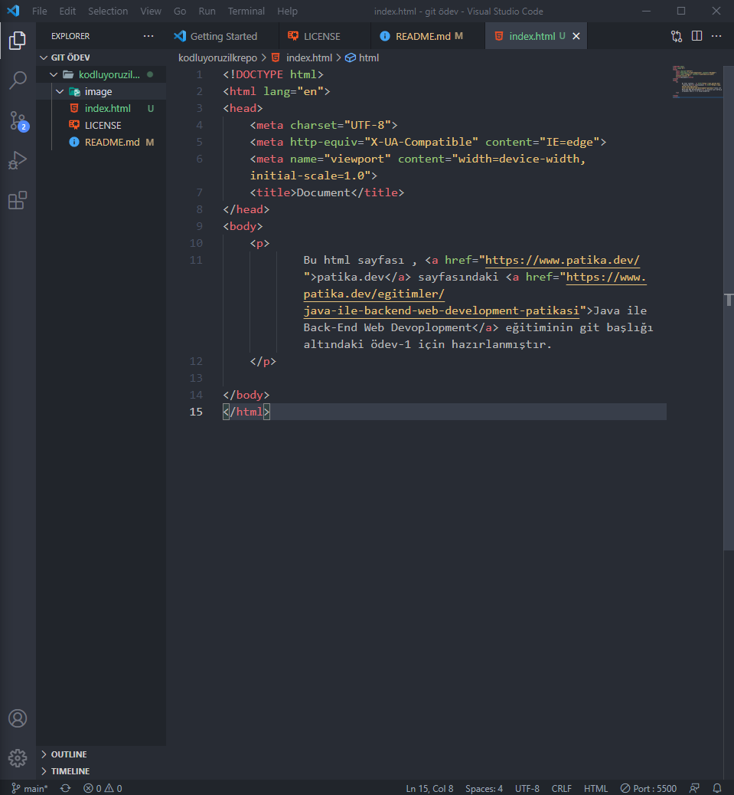
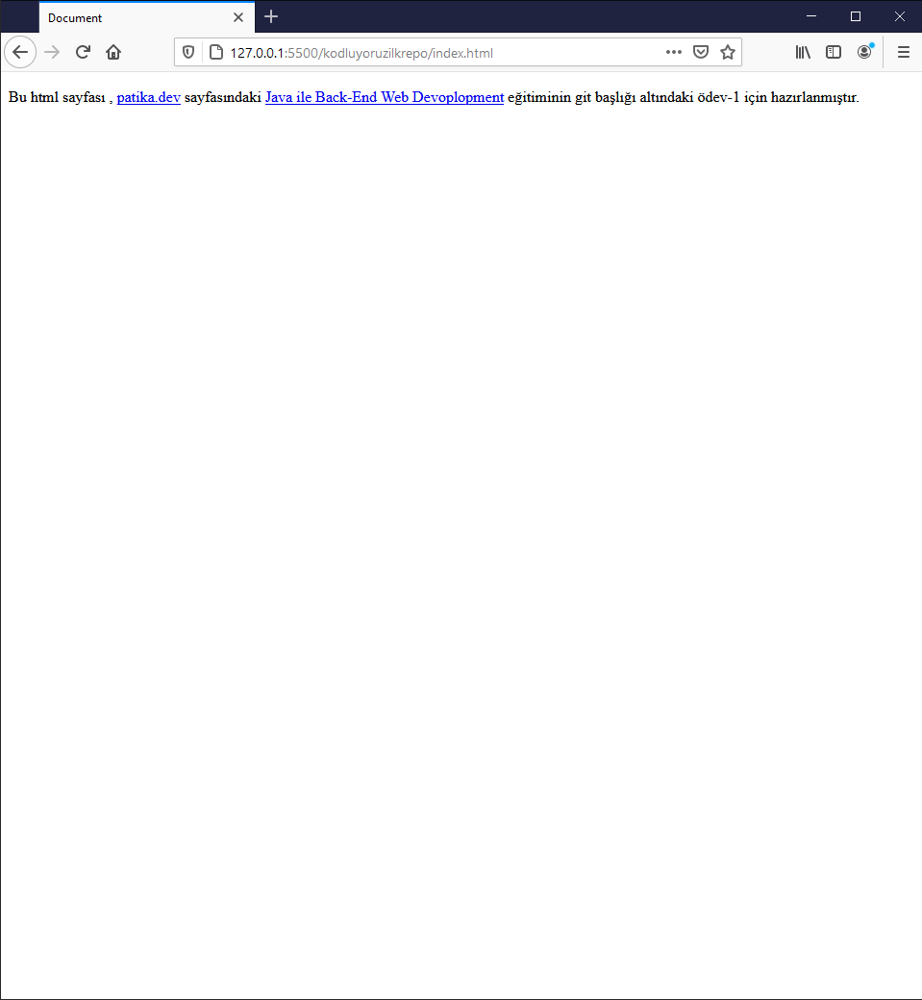

# Kodluyoruz Ilk Repo

Bu repo [Kodluyoruz](https://www.kodluyoruz.org) Java ile Back-End Web Development eğitiminde oluşturduğum ilk repo. İçerisinde bir adet README dosyası, bir adet de index.html barındırıyor.


## Installation

Öncelikle projeyi clonelayın. 

```bash
git clone https://github.com/kaganarmagan/kodluyoruzilkrepo.git
```

## Usage

Projeyi cloneladıktan sonra Visual Studio Code programında açınız.

Linux için:
```linux
cd kodluyoruzilkrepo
code .
```

## Image

 



## License
[MIT](https://github.com/kaganarmagan/kodluyoruzilkrepo/blob/main/LICENSE)
